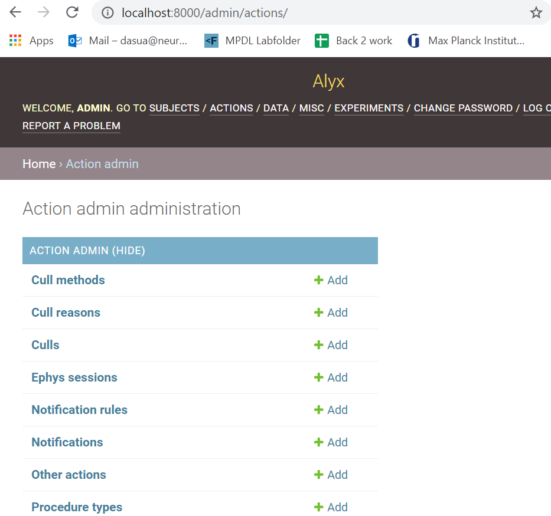

### IBL-rig installation

1. Navigate to `C:/`
2. Clone iblrig code:

    ```commandline
    git clone https://github.com/int-brain-lab/iblrig
    ```
   
3. Navigate to `../iblrig`:

    ````commandline
    cd iblrig
    ````

4. Install ibl package, it will automatically create an
enviroment:
    
   ```commandline
   python install.py
   ```
   
5. When prompted to install `Bonsai` press `y` and enter.

6. Activate the environment created by iblrig:

    ```commandline
   conda activate iblrig
    ```
   
7. You can now launch `pybpod` (a GUI should appear):

    ```commandline
   start-pybpod
    ```
   
### Alyx installation

**if your machine is running Windows 10 you have to create
a Windows subsystem for Linux**. For that:

1. Download and install 
[Ubuntu Terminal on Windows](https://www.microsoft.com/store/productId/9NBLGGH4MSV6)

2. Then enable and install Windows subsystem. Open a PowerShell as admin and type:

    ```commandline
    Enable-WindowsOptionalFeature -Online -FeatureName Microsoft-Windows-Subsystem-Linux
   ```

3. Download [Ubuntu 18.04 distro](https://aka.ms/wsl-ubuntu-1804). Double click to run (forget about unzipping)

4. Add distro to Windows PATH from PowerShell line:

    ```commandline
    $userenv = [System.Environment]::GetEnvironmentVariable("Path", "User")
    [System.Environment]::SetEnvironmentVariable("PATH", $userenv + ";C:\Users\Administrator\Ubuntu", "User")
    ```

5. Run `Ubuntu 18.04` which should appear in the launch line of Windows if you type that. It will install some stuff.
If prompted to ask every time for reboot just move to `yes` with the arrows in the keyboard and press enter. It may
reboot a couple of times (so close everything else before this step). You will have to
create a user and a sudo password.

6. Now you should follow the instructions to setup [alyx](https://github.com/cortex-lab/alyx). However don´t do it.
Follow the modification of their instructions that I write below. Close any open Ubuntu prompts, launch a new one
like in the previous step. Then run:

```commandline
$ sudo apt-get update
$ sudo apt-get install python3-pip python3-dev libpq-dev postgresql postgresql-contrib virtualenv
$ sudo touch /var/log/alyx.log; sudo chmod 776 /var/log/alyx.log;
$ sudo mkdir uploaded
$ sudo chmod 775 -fR uploaded
$ sudo chown www-data:www-data -fR uploaded
$ git clone https://github.com/cortex-lab/alyx.git
$ cd alyx
$ virtualenv alyxvenv --python=python3
$ source ./alyxvenv/bin/activate
$ pip install -r requirements.txt
$ python setup.py
```

Now it will ask for a database name, a username and a password like:

Enter a database name [labdb]:
Enter a postgres username [labdbuser]:
Enter a postgres password:

Wait until is done (**do NOT press ctrl C**). Finally 
initialize fixtures:
```commandline
$ cd scripts
$ ./load-init-fixtures.sh
```

Wait until is done. Run this to launch the server:

```commandline
$ python alyx/manage.py runserver
```

Now open any explorer like Firefox or Chrome and try to reach the server
in `http://localhost:8000/admin`. Use user: `admin` and password:`admin`

You should now see something like


